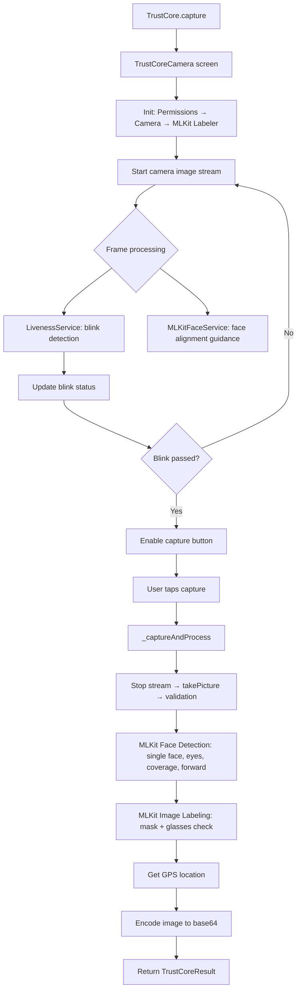

# TrustCore Plugin — AI Agent Context Reference

> **Last updated**: 2026-02-27  
> **Plugin path**: `/Users/arsh/working/projects/AI/Enhanced/plugins/TrustCore/trust_core`

## Overview

TrustCore is a **single-function, offline, free Flutter plugin** for face capture with real-time validation. It opens a camera screen, runs 6 validation checks in real-time, and returns a validated face image as base64 along with GPS coordinates.

**Single entry point:**
```dart
final result = await TrustCore.capture(context);
// Returns TrustCoreResult? (null if cancelled)
```

---

## Architecture

```
lib/
├── trust_core.dart                    # Public API: TrustCore.capture()
└── src/
    ├── trust_core_camera.dart         # Main camera screen (StatefulWidget)
    ├── trust_core_result.dart         # Result model (base64, lat, lon, timestamp)
    ├── services/
    │   ├── mlkit_face_service.dart    # Face detection, eyes, forward, contour-based coverage
    │   ├── liveness_service.dart      # Blink detection for liveness
    │   ├── tflite_service.dart        # (Internal name retained) MLKit Image Labeling for mask & glasses
    │   └── location_service.dart      # GPS via Geolocator with permission handling
    └── widgets/
        ├── face_oval_painter.dart     # Face oval overlay with corner marks
        └── check_indicator.dart       # CheckStatus UI panel (6 checks)
```

### Note on Mask & Glasses Detection
The plugin now uses **Google ML Kit Image Labeling** instead of custom TFLite models for more robust detection of masks, glasses, and eyewear. The `TFLiteService` class name is retained for compatibility but internally calls ML Kit.

---

## Dependencies (`pubspec.yaml`)

| Package | Version | Purpose |
|---|---|---|
| `camera` | ^0.11.1 | Camera preview and image capture |
| `google_mlkit_face_detection` | ^0.12.0 | Face detection, classification, landmarks, contours |
| `google_mlkit_image_labeling` | ^0.12.0 | Detect mask, glasses, spectacles, eyewear |
| `geolocator` | ^11.0.0 | GPS location (uses v11.1.0 API) |
| `permission_handler` | ^11.4.0 | Camera permission request |
| `image` | ^4.5.3 | Image decoding, cropping, resizing |

---

## Data Flow



---

## The 6 Validation Checks

| # | Check | Service | When Checked | How |
|---|---|---|---|---|
| 1 | **Liveness** | `LivenessService` | Live stream | Blink detection: eyes open (>0.8) → closed (<0.3) |
| 2 | **Single face** | `MLKitFaceService` | After capture | `faces.length == 1` |
| 3 | **Eyes open** | `MLKitFaceService` | After capture | `leftEyeOpenProb > 0.65 && rightEyeOpenProb > 0.65` |
| 4 | **No mask** | `TFLiteService` | After capture | MLKit Labeler keywords: 'mask', 'respirator', etc. |
| 5 | **No glasses** | `TFLiteService` | After capture | MLKit Labeler keywords: 'glass', 'spectacle', etc. |
| 6 | **Face not covered** | `MLKitFaceService` | After capture | Contours missing for nose-bottom or lips |

### Check Status Enum
```dart
enum CheckStatus { pending, pass, fail, loading }
```

### Error UX
If any check fails after capture, the UI shows red icons and the error message for **3 seconds** before resetting everything to `pending` and restarting the camera stream.

---

## Key File Details

### `trust_core_camera.dart` — Main Screen

**Blink-to-Unlock**:
The capture button is disabled until a blink is detected. The live stream only evaluates liveness and face positioning. All other "hard" checks (mask, eyes, coverage) are performed on the high-quality still image after the user taps capture.

**Retry with Delay**:
`_showRetry(message)` is async. It keeps the failure UI visible for 3 seconds using `Future.delayed` before resetting state.

### `mlkit_face_service.dart` — Face Detection
- **`_isFaceCovered(face)`**: Uses ML Kit contours. Returns true if neither nose-bottom nor lip contours are detectable.

### `tflite_service.dart` — ML Kit Labeling
- Uses `google_mlkit_image_labeling`.
- Crops the captured image to the `faceRect` provided by ML Kit Face Detection.
- Searches for keywords in detected labels (e.g., "glasses", "spectacle", "mask").

---

## Change History

### 2026-02-27 — Session Fixes
1. **Simplified Flow**: Moved complex checks (mask, eyes, coverage) from continuous live stream to post-capture validation for better performance and battery life.
2. **MLKit Image Labeling**: Replaced custom TFLite models with Google ML Kit for more accurate mask and glasses detection.
3. **Contour-based Coverage**: Switched from mesh points to nose/mouth contours to detect face coverings.
4. **Improved Error Messaging**: Added a 3-second delay in `_showRetry` so users can read fail reasons.
5. **Location fix**: Updated to Geolocator 11.1.0 and native permission handling.
