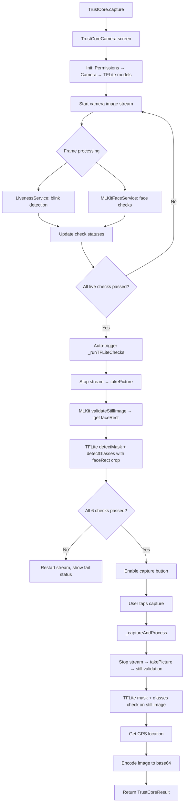

# TrustCore Plugin — AI Agent Context Reference

> **Last updated**: 2026-02-27  
> **Plugin path**: `/Users/arsh/working/projects/AI/Enhanced/plugins/TrustCore/trust_core`

## Overview

TrustCore is a **single-function, offline, free Flutter plugin** for face capture with real-time validation. It opens a camera screen, runs 6 validation checks in real-time, and returns a validated face image as base64 along with GPS coordinates.

**Single entry point:**
```dart
final result = await TrustCore.capture(context);
// Returns TrustCoreResult? (null if cancelled)
```

---

## Architecture

```
lib/
├── trust_core.dart                    # Public API: TrustCore.capture()
└── src/
    ├── trust_core_camera.dart         # Main camera screen (StatefulWidget)
    ├── trust_core_result.dart         # Result model (base64, lat, lon, timestamp)
    ├── services/
    │   ├── mlkit_face_service.dart    # Face detection, eyes, forward, mesh coverage
    │   ├── liveness_service.dart      # Blink detection for liveness
    │   ├── tflite_service.dart        # TFLite mask & glasses classifiers
    │   └── location_service.dart      # GPS via Geolocator with permission handling
    └── widgets/
        ├── face_oval_painter.dart     # Face oval overlay with corner marks
        └── check_indicator.dart       # CheckStatus UI panel (6 checks)
```

### Assets
```
assets/
├── mobilefacenet.tflite             # (Legacy, not used in current flow)
└── models/
    ├── mask_detector.tflite          # Binary classifier: no_mask (class0) / mask (class1)
    └── glasses_detector.tflite       # Binary classifier: no_glasses (class0) / glasses (class1)
```

---

## Dependencies (`pubspec.yaml`)

| Package | Version | Purpose |
|---|---|---|
| `camera` | ^0.11.1 | Camera preview and image capture |
| `google_mlkit_face_detection` | ^0.12.0 | Face detection, classification, landmarks |
| `google_mlkit_face_mesh_detection` | ^0.3.0 | 468-point face mesh for coverage check |
| `tflite_flutter` | ^0.11.0 | Run TFLite models for mask/glasses |
| `geolocator` | ^11.0.0 | GPS location (uses v11.1.0 API) |
| `permission_handler` | ^11.4.0 | Camera permission request |
| `image` | ^4.5.3 | Image decoding, cropping, resizing |

---

## Data Flow



---

## The 6 Validation Checks

| # | Check | Service | When Checked | How |
|---|---|---|---|---|
| 1 | **Liveness** | `LivenessService` | Live stream | Blink detection: eyes open (>0.8) → closed (<0.3) |
| 2 | **Single face** | `MLKitFaceService` | Live stream | `faces.length == 1` |
| 3 | **Eyes open** | `MLKitFaceService` | Live stream | `leftEyeOpenProb > 0.65 && rightEyeOpenProb > 0.65` |
| 4 | **No mask** | `TFLiteService` | Auto-captured still | `mask_detector.tflite`, class1 > class0 && > 0.5 |
| 5 | **No spectacles** | `TFLiteService` | Auto-captured still | `glasses_detector.tflite`, class1 > class0 && > 0.5 |
| 6 | **Face not covered** | `MLKitFaceService` | Live stream | Face mesh < 350/468 landmarks → covered |

### Check Status Enum
```dart
enum CheckStatus { pending, pass, fail, loading }
```

### Persistent Pass Logic
Once a check reaches `pass`, it is **never re-evaluated** in subsequent frames. Statuses only reset on retry (`_showRetry`) which resets all to `pending`.

---

## Key File Details

### `trust_core.dart` — Public API
- **`TrustCore.capture(BuildContext context)`** → `Future<TrustCoreResult?>`
- Pushes `TrustCoreCamera` as fullscreen dialog
- Returns `null` if user cancels

### `trust_core_result.dart` — Result Model
```dart
class TrustCoreResult {
  final String base64Image;  // JPEG as base64
  final double latitude;
  final double longitude;
  final DateTime capturedAt;
  Map<String, dynamic> toMap();
}
```

### `trust_core_camera.dart` — Main Screen (~610 lines)

**Init sequence** (`_initAll`):
1. Request camera + location permissions
2. Init front camera (ResolutionPreset.high, NV21, no audio)
3. Load TFLite models
4. Start image stream → `_onCameraFrame`

**Frame processing** (`_onCameraFrame`):
- Skips if `_isCapturing` or `_isProcessing`
- Runs `LivenessService.processFrame()` only if liveness not yet passed
- Runs `MLKitFaceService.processFrame()` only if face checks not all passed
- Calls `_updateCheckStatuses()` → `_checkAllPassed()`

**Auto TFLite trigger** (`_runTFLiteChecks`):
- Triggered automatically when live checks (liveness, face, eyes, coverage) all pass
- Guarded by `_isRunningTFLite` flag to prevent re-entry
- Stops stream → takes picture → runs MLKit on still for correct `faceRect`
- Runs TFLite mask and glasses with face crop → updates statuses
- Restarts stream
- On exception: marks mask/glasses as pass (fallback)

**Capture** (`_captureAndProcess`):
- Requires liveness blink confirmed
- Stops stream → takes picture
- Runs MLKit `validateStillImage` with all checks
- Runs TFLite mask + glasses with `faceRect` crop
- Gets GPS via `LocationService.getCurrentPosition()`
- Encodes image: decode → resize to 800px width → JPEG quality 85 → base64
- Returns `TrustCoreResult` via `Navigator.pop()`

**Retry** (`_showRetry`):
- Resets ALL statuses to `pending`
- Resets `_isRunningTFLite = false`
- Resets `_livenessService`
- Restarts image stream

**UI structure** (Stack):
1. Camera preview (FittedBox, BoxFit.cover)
2. Face oval overlay (`FaceOvalPainter`)
3. Close button (top-left)
4. Bottom panel: main message, check indicators, capture button

### `mlkit_face_service.dart` — Face Detection

**`FrameCheckResult`** fields:
- `faceFound`, `multipleFaces`, `eyesOpen`, `faceForward`, `faceCovered`
- `faceCount`, `leftEyeProb`, `rightEyeProb`, `faceRect`

**`processFrame()`** — Live stream analysis:
- Processes every 4th frame
- Converts NV21 CameraImage → InputImage
- Runs FaceDetector + FaceMeshDetector
- Face forward: `eulerY.abs() < 20 && eulerZ.abs() < 20`
- Face covered: mesh points < 350/468

**`validateStillImage()`** — Same checks but from file path (JPEG)

### `liveness_service.dart` — Blink Detection
- Separate FaceDetector instance (classification only, fast mode)
- Processes every 3rd frame
- Blink = eyes open (>0.8) in previous frame → eyes closed (<0.3) in current frame
- Once `_blinkDetected = true`, stays true until `reset()`

### `tflite_service.dart` — Mask & Glasses Classification
- Loads `mask_detector.tflite` and `glasses_detector.tflite` from assets
- Input: 224×224 RGB float32 tensor `[1, 224, 224, 3]` normalized to [0,1]
- Output: `[1, 2]` → `[class0_prob, class1_prob]`
- Detection: `class1 > class0 && class1 > 0.5`
- Supports optional `faceRect` for cropping before resize
- Debug prints `[TFLite]` confidence scores

### `location_service.dart` — GPS
- Uses Geolocator's own `checkPermission()` / `requestPermission()` (NOT permission_handler)
- `getCurrentPosition(desiredAccuracy: LocationAccuracy.high, timeLimit: 10s)`
- Fallback to `getLastKnownPosition()`
- Debug prints `[Location]` status

### `face_oval_painter.dart` — Oval Overlay
- Uses `PathFillType.evenOdd` for transparent oval hole (NOT BlendMode.clear)
- Oval: center at (width/2, height×0.42), size 68%×46%
- Border color: white (pending), green (all passed), yellow (capturing)
- Corner tick marks at oval bounding box

### `check_indicator.dart` — Status Panel
- `CheckStatus`: pending → white38, pass → green, fail → red, loading → yellow spinner

---

## Known Issues & Gotchas

1. **faceRect coordinate mismatch**: Live stream faceRect (NV21 rotated) does NOT match captured JPEG coordinates. Always run `validateStillImage()` on the captured image to get correct faceRect for TFLite cropping.

2. **TFLite model output classes**: If detection seems inverted, check the debug `[TFLite]` logs. Current assumption: class0 = no_mask/no_glasses, class1 = mask/glasses.

3. **Camera rotation**: Hardcoded to `InputImageRotation.rotation270deg` for front camera on Android. May need adjustment for iOS or different devices.

4. **Location permission**: Uses Geolocator's own permission API, NOT permission_handler. The `permission_handler` is only used for camera permission in `_requestPermissions()`.

5. **TFLite model fallback**: If models fail to load, mask/glasses checks are auto-passed so they don't block the user.

---

## Host App Requirements

### Android (`AndroidManifest.xml`)
```xml
<uses-permission android:name="android.permission.CAMERA"/>
<uses-permission android:name="android.permission.ACCESS_FINE_LOCATION"/>
<uses-permission android:name="android.permission.ACCESS_COARSE_LOCATION"/>
```

### iOS (`Info.plist`)
```xml
<key>NSCameraUsageDescription</key>
<string>Camera access for face verification</string>
<key>NSLocationWhenInUseUsageDescription</key>
<string>Location access for verification</string>
```

### Usage
```dart
import 'package:trust_core/trust_core.dart';

final result = await TrustCore.capture(context);
if (result != null) {
  // result.base64Image — send to your backend
  // result.latitude, result.longitude — GPS
  // result.capturedAt — timestamp
}
```

---

## Change History

### 2026-02-27 — Session Fixes
1. **Black spot fix**: Replaced `BlendMode.clear` with `PathFillType.evenOdd` in `FaceOvalPainter`
2. **Persistent pass logic**: Once a check passes, it stays passed (no re-evaluation per frame)
3. **Auto TFLite checks**: Mask/glasses now auto-trigger when live checks pass (no longer stuck on loading)
4. **faceRect fix**: `_runTFLiteChecks` now runs MLKit on the captured still image for correct face coordinates
5. **Location fix**: Rewrote `LocationService` to use Geolocator's own permission API and correct v11.1.0 parameters
6. **Detection threshold**: Lowered from 0.75 to 0.5, now uses class comparison (class1 > class0)
7. **Debug logging**: Added `[TFLite]` and `[Location]` debug prints for on-device diagnostics
8. **Retry reset**: `_showRetry` now resets ALL statuses including mask/glasses/TFLite flag
